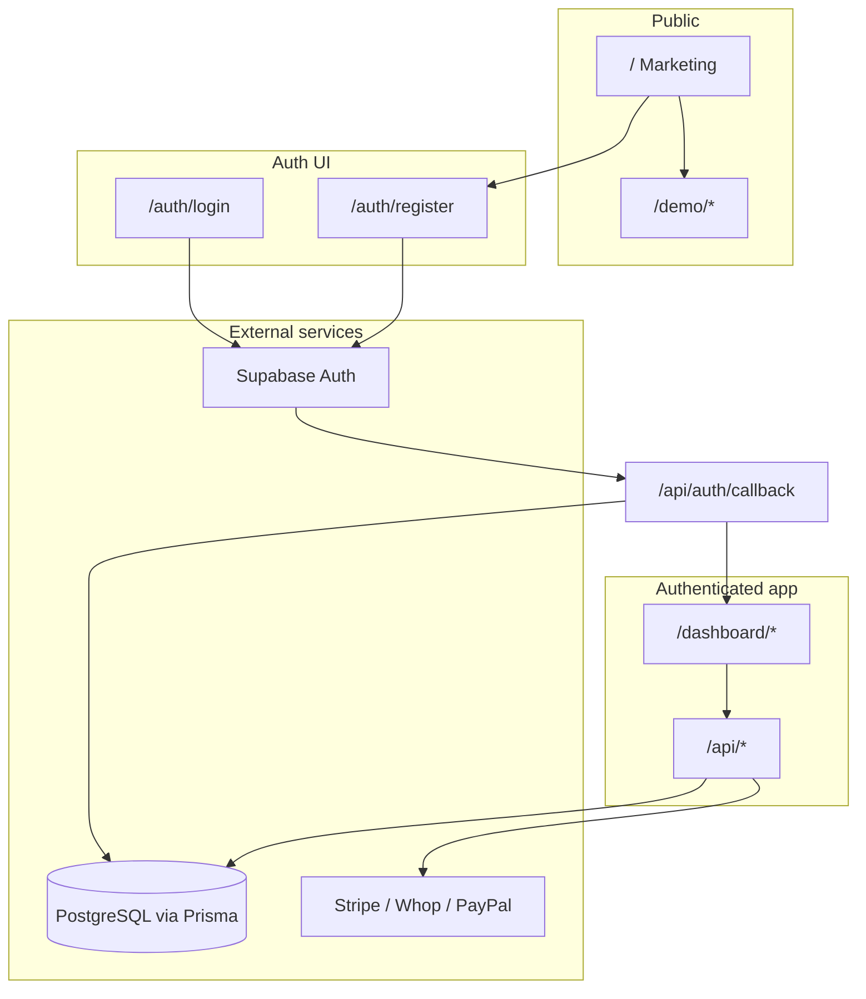

# Architecture overview

Launch Kit is a **single Next.js 15 app** that serves three audiences from one codebase:

| Audience      | Experience                        | Auth required        |
| ------------- | --------------------------------- | -------------------- |
| **Visitors**  | Marketing site + public demos     | No                   |
| **Customers** | Sign up, dashboard, billing, team | Yes (Supabase)       |
| **Operators** | Platform admin console            | Yes + platform admin |

---

## High-level map

---

## Layer 1 — Marketing website

**Entry:** `/` (`src/app/page.tsx`)

| Section          | Purpose                                                       |
| ---------------- | ------------------------------------------------------------- |
| Hero             | Free trial CTA, demo, GitHub; quick-link pills; theme preview |
| Features         | Capability grid with links to `/demo/*`                       |
| Product showcase | Clickable cards → `/demo`, `/demo/billing`, `/demo/settings`  |
| How it works     | Demo → register → billing journey (`STEPS`)                   |
| Pricing          | Example tiers → `/auth/register?plan=`; billing demo link     |
| FAQ              | Fork + customer journey (two-column accordion)                |
| CTA              | Register, demo, docs                                          |

**UX details:** sticky glass header with scroll-aware nav, `marketing-section` spacing, card hover states — see [MARKETING.md](./MARKETING.md).

**Also public:** `/privacy`, `/terms`, `/design-system`, `/docs`

Copy and links live in `src/lib/marketing.ts` and `src/lib/marketing-content.ts`.

---

## Layer 2 — Auth (frontend + Supabase)

**Pages:** `/auth/login`, `/auth/register`, `/auth/forgot-password`, `/auth/reset-password`, `/auth/invite`

| Step                       | What happens                                                        |
| -------------------------- | ------------------------------------------------------------------- |
| User submits form or OAuth | Browser calls **Supabase Auth** directly                            |
| Register with `?plan=`     | OAuth `redirectTo` includes `/dashboard/billing?plan=`              |
| OAuth / email link returns | `GET /api/auth/callback` exchanges code                             |
| Callback                   | Upserts `User` in Prisma, syncs platform admin, creates default org |
| Session                    | HTTP-only cookies via `@supabase/ssr`                               |

**There is no custom `POST /api/login`.** Session validation runs in:

- `src/middleware.ts` — redirects guests away from `/dashboard`
- `src/lib/auth.ts` — `requireAuth()`, `requireAuthApi()`, org role helpers

---

## Layer 3 — Customer app (subscribers)

After login, users land on **`/dashboard`**.

| Route                  | Purpose                                        |
| ---------------------- | ---------------------------------------------- |
| `/dashboard`           | Overview, metrics, onboarding checklist        |
| `/dashboard/analytics` | Charts                                         |
| `/dashboard/team`      | Members                                        |
| `/dashboard/billing`   | **Subscribe** — checkout + manage subscription |
| `/dashboard/settings`  | Profile, org, invites, API keys                |
| `/dashboard/audit`     | Org audit log (feature flag)                   |

**Billing flow:**

1. User picks plan on `/dashboard/billing` (or arrives from marketing with `?plan=pro`)
2. `BillingActions` → `POST /api/stripe/checkout` (or Whop/PayPal)
3. Redirect to provider hosted checkout
4. Webhook updates `Subscription` in Prisma
5. User returns to `/dashboard/billing?success=1`

Org **ADMIN** / **SUPER_ADMIN** can start checkout; **MEMBER** can view only.

---

## Layer 4 — Platform admin (operators)

| Route              | Purpose                                            |
| ------------------ | -------------------------------------------------- |
| `/dashboard/admin` | Real admin console (env + `PLATFORM_ADMIN_EMAILS`) |
| `/demo/admin`      | Public admin preview (sample data)                 |
| `/api/admin/*`     | Users, orgs, settings, audit, billing overview     |

See [ADMIN.md](./ADMIN.md).

---

## Layer 5 — Public demos

No auth. Mock data only.

| Route            | Mirrors               |
| ---------------- | --------------------- |
| `/demo`          | `/dashboard`          |
| `/demo/billing`  | `/dashboard/billing`  |
| `/demo/settings` | `/dashboard/settings` |
| `/demo/admin`    | `/dashboard/admin`    |

Data: `src/lib/demo-data.ts`, `src/lib/demo-admin-data.ts`.

---

## Data model (summary)

| Store                   | Holds                                                                          |
| ----------------------- | ------------------------------------------------------------------------------ |
| **Supabase Auth**       | Credentials, OAuth identities, sessions                                        |
| **PostgreSQL (Prisma)** | Users, orgs, members, subscriptions, plans, audit, API keys, platform settings |

App users are linked by shared `User.id` (Supabase UUID).

---

## API surface (grouped)

| Group   | Examples                                                  |
| ------- | --------------------------------------------------------- |
| Auth    | `/api/auth/callback`, `/api/auth/signup-status`           |
| Billing | `/api/stripe/*`, `/api/whop/*`, `/api/paypal/*`, webhooks |
| Org     | Invitations, org switch, team                             |
| Admin   | `/api/admin/*`                                            |
| Health  | `/api/health`                                             |

Full route tables: [README Routes](../README.md#-routes--api).

---

## Security boundaries

| Concern          | Implementation                                       |
| ---------------- | ---------------------------------------------------- |
| Route protection | Middleware + `requireAuth`                           |
| Org RBAC         | `requireOrgRole`                                     |
| Platform admin   | `requirePlatformAdmin` + feature flag                |
| API keys         | `requireApiKey` (custom integrations)                |
| Headers          | CSP, rate limits — see [SECURITY.md](../SECURITY.md) |

---

## Key files

| Area            | Path                                                             |
| --------------- | ---------------------------------------------------------------- |
| Marketing       | `src/lib/marketing.ts`, `src/components/marketing/*`             |
| Auth UI         | `src/components/auth/*`, `src/app/auth/*`                        |
| Session         | `src/middleware.ts`, `src/lib/supabase/*`                        |
| Dashboard shell | `src/components/dashboard/dashboard-shell.tsx`                   |
| Billing UI      | `src/components/billing/*`, `src/app/dashboard/billing/page.tsx` |
| Admin UI        | `src/components/admin/*`                                         |
| Schema          | `prisma/schema.prisma`                                           |

---

## Related docs

- [MARKETING.md](./MARKETING.md) — landing page and customer journey
- [ADMIN.md](./ADMIN.md) — platform operator console
- [BILLING.md](./BILLING.md) — payment providers
- [CUSTOMIZATION.md](./CUSTOMIZATION.md) — branding and env
- [UI_UX.md](./UI_UX.md) — design patterns
- [README.md](../README.md) — setup and deployment
