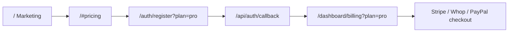

# Marketing website guide

  
  
  

Launch Kit ships a **full marketing landing page** at `/` plus an in-app documentation hub at `/docs`. This guide covers structure, customization, and how marketing connects to signup and billing.

See also: [ARCHITECTURE.md](./ARCHITECTURE.md) · [UI_UX.md](./UI_UX.md) · [CUSTOMIZATION.md](./CUSTOMIZATION.md)

---

## Page structure

| #   | Section          | Component                  | Anchor          |
| --- | ---------------- | -------------------------- | --------------- |
| 1   | Hero             | `hero-section.tsx`         | —               |
| 2   | Built-with strip | `built-with-strip.tsx`     | —               |
| 3   | Stats bar        | `stats-bar.tsx`            | —               |
| 4   | Logo cloud       | `logo-cloud.tsx`           | —               |
| 5   | Features         | `features-section.tsx`     | `#features`     |
| 6   | Product showcase | `product-showcase.tsx`     | `#showcase`     |
| 7   | Integrations     | `integrations-section.tsx` | —               |
| 8   | How it works     | `how-it-works-section.tsx` | `#how-it-works` |
| 9   | Pricing          | `pricing-section.tsx`      | `#pricing`      |
| 10  | Testimonials     | `testimonials-section.tsx` | —               |
| 11  | FAQ              | `faq-section.tsx`          | `#faq`          |
| 12  | CTA              | `cta-section.tsx`          | —               |

Assembly: `src/app/page.tsx` — header, sections, footer.

---

## Header & footer

| Component         | Path                                         | Behavior                                                    |
| ----------------- | -------------------------------------------- | ----------------------------------------------------------- |
| `MarketingHeader` | `src/components/layout/marketing-header.tsx` | Sticky glass nav, scroll-aware active section, mobile sheet |
| `MarketingFooter` | `src/components/layout/marketing-footer.tsx` | CTA strip, product/legal/connect links                      |

**Header links:** Features, Product, How it works, Pricing, FAQ, Docs (`/docs`), Design (`/design-system`), Sign in, Demo, Get started.

**Footer links:** Defined in `FOOTER_LINKS` inside `src/lib/marketing.ts`.

---

## Customer journey (marketing → app)

| Step        | URL                        | Notes                                                 |
| ----------- | -------------------------- | ----------------------------------------------------- |
| Browse      | `/`                        | Hero quick-links to demo, docs, pricing               |
| Preview     | `/demo`, `/demo/billing`   | No login — sample subscriber UI                       |
| Choose plan | `/#pricing`                | `PLANS[].href` → `/auth/register?plan=starter\|pro`   |
| Register    | `/auth/register?plan=`     | Badge shows selected plan; OAuth redirects to billing |
| Subscribe   | `/dashboard/billing?plan=` | Highlights matching DB plan card                      |

Plan slug helpers: `src/lib/plan-selection.ts` (`buildRegisterHref`, `buildPostSignupBillingPath`, `planMatchesSlug`).

---

## Content files

### Primary — `src/lib/marketing.ts`

| Export           | Purpose                                      |
| ---------------- | -------------------------------------------- |
| `STATS`          | Stats bar numbers                            |
| `LOGO_CLOUD`     | Tech stack names                             |
| `FEATURES`       | Feature grid (optional `href` per card)      |
| `SHOWCASE_ITEMS` | Product cards with `/demo/*` links           |
| `STEPS`          | How-it-works steps                           |
| `PLANS`          | Pricing tiers (`slug`, `href` with `?plan=`) |
| `FAQ_ITEMS`      | Accordion questions                          |
| `NAV_LINKS`      | Header anchor links                          |
| `FOOTER_LINKS`   | Footer columns                               |
| `TESTIMONIALS`   | Quote cards                                  |
| `CTA_SECTION`    | Bottom CTA copy                              |

### Supporting — `src/lib/marketing-content.ts`

| Export            | Purpose                          |
| ----------------- | -------------------------------- |
| `AUTH_PANEL`      | Auth layout sidebar quote        |
| `BUILT_WITH`      | Built-with strip links           |
| `PLAN_COMPARISON` | Pricing comparison table rows    |
| `CUSTOMIZE_HINT`  | Small hint under pricing heading |

### Site constants — `src/lib/site.ts`

| Constant              | Default       | Used for             |
| --------------------- | ------------- | -------------------- |
| `DEMO_DASHBOARD_PATH` | `/demo`       | Demo links           |
| `DEMO_ADMIN_PATH`     | `/demo/admin` | Admin demo links     |
| `DOCS_HUB_PATH`       | `/docs`       | In-app doc hub       |
| `APP_TAGLINE`         | env           | Hero headline        |
| `APP_DESCRIPTION`     | env           | Hero + footer + meta |

---

## Visual system (CSS)

Marketing utilities in `src/styles/globals.css`:

| Class                     | Effect                                     |
| ------------------------- | ------------------------------------------ |
| `.marketing-section`      | Consistent section padding + scroll margin |
| `.marketing-card-hover`   | Subtle lift + border glow on hover         |
| `.marketing-eyebrow-line` | Gradient line under section eyebrows       |
| `.mesh-gradient`          | Hero / CTA background                      |
| `.grid-pattern`           | Hero grid overlay                          |
| `.glass`                  | Sticky header backdrop                     |

Theme presets: `NEXT_PUBLIC_THEME_PRESET` — see [UI_UX.md](./UI_UX.md).

---

## Hero & interactive preview

**Hero** (`hero-section.tsx`):

- Primary CTA: **Start free trial** → `/auth/register`
- Secondary: **View live demo** → `/demo`
- Quick-link pills: demo routes, docs, pricing
- Live theme preview: `MarketingThemePreview`

**Hero visual** (`hero-visual.tsx`):

- Tabbed mini-dashboard (Overview / Billing / Team)
- Deep-links to `/demo`, `/demo/billing`, `/demo/team`

---

## Pricing section

- Three example tiers in `PLANS` (Starter, Pro, Enterprise)
- Starter/Pro link to register with `?plan=` query
- **14-day trial** badges on paid tiers
- Comparison table from `PLAN_COMPARISON` in `marketing-content.ts`
- Link to **billing demo** at `/demo/billing`

**Important:** Marketing prices are **copy only**. Real checkout uses `Plan` rows in the database on `/dashboard/billing`. Sync plans via `npm run db:seed` after configuring Stripe/Whop/PayPal — see [BILLING.md](./BILLING.md).

---

## FAQ

Seven questions covering:

- MIT license and commercial use
- Payment providers
- Demo vs real account
- Post-registration flow
- Team invites
- UI customization

Rendered as a **two-column accordion** with smooth expand/collapse (`faq-section.tsx`).

---

## Auth pages (marketing-adjacent)

Auth layout (`src/app/auth/layout.tsx`):

- Gradient sidebar with `AUTH_PANEL` quote
- **Live demo** and **Compare plans** links on desktop
- **Live demo** link in mobile header

Register page shows **Selected plan** badge when `?plan=` is present.

---

## Demos linked from marketing

| Marketing touchpoint | Demo URL                                   |
| -------------------- | ------------------------------------------ |
| Hero CTA             | `/demo`                                    |
| Hero pills           | `/demo`, `/demo/billing`, `/demo/admin`    |
| Feature cards        | `/demo`, `/demo/billing`, `/demo/admin`    |
| Showcase cards       | `/demo`, `/demo/billing`, `/demo/settings` |
| Pricing footer       | `/demo/billing`                            |
| Footer CTA           | `/demo`, `/docs`                           |

Demo data: `src/lib/demo-data.ts`. Admin demo: `src/lib/demo-admin-data.ts`.

---

## Customization checklist

1. Set branding env vars (see [CUSTOMIZATION.md](./CUSTOMIZATION.md) §1)
2. Edit `PLANS`, `FEATURES`, `FAQ_ITEMS` in `marketing.ts`
3. Update `AUTH_PANEL` and `PLAN_COMPARISON` in `marketing-content.ts`
4. Swap testimonials and stats for your product
5. Point `NEXT_PUBLIC_GITHUB_REPO` and `NEXT_PUBLIC_SUPPORT_EMAIL` to your org
6. Replace `/privacy` and `/terms` placeholder legal copy
7. Run `npm run dev` and verify `/`, `/docs`, and `/demo`

---

## Related docs

- [ARCHITECTURE.md](./ARCHITECTURE.md) — full stack map
- [UI_UX.md](./UI_UX.md) — dashboard and design system
- [BILLING.md](./BILLING.md) — payment provider setup
- [ADMIN.md](./ADMIN.md) — platform admin + `/demo/admin`
